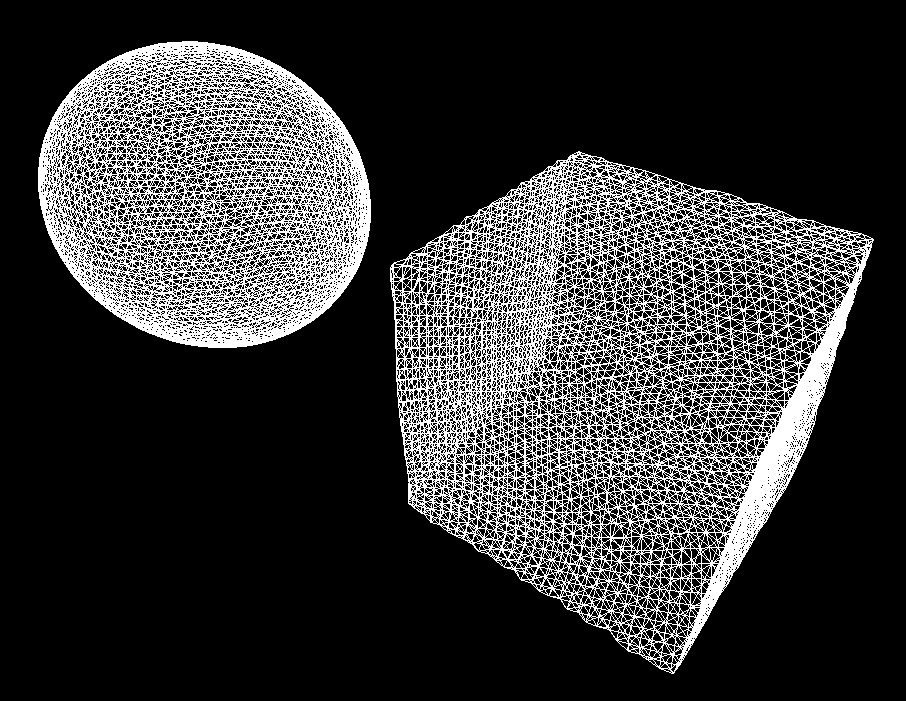
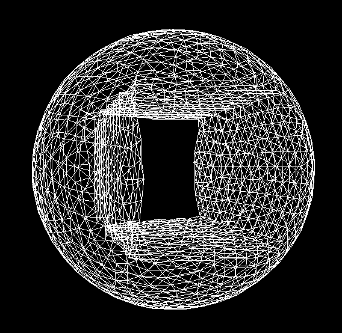
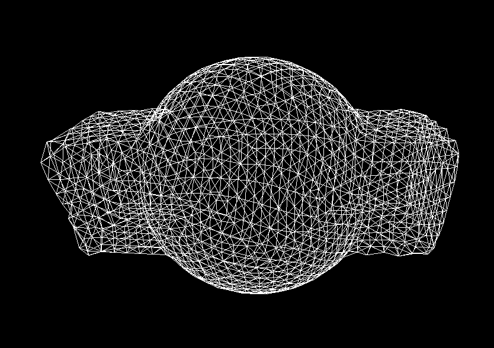
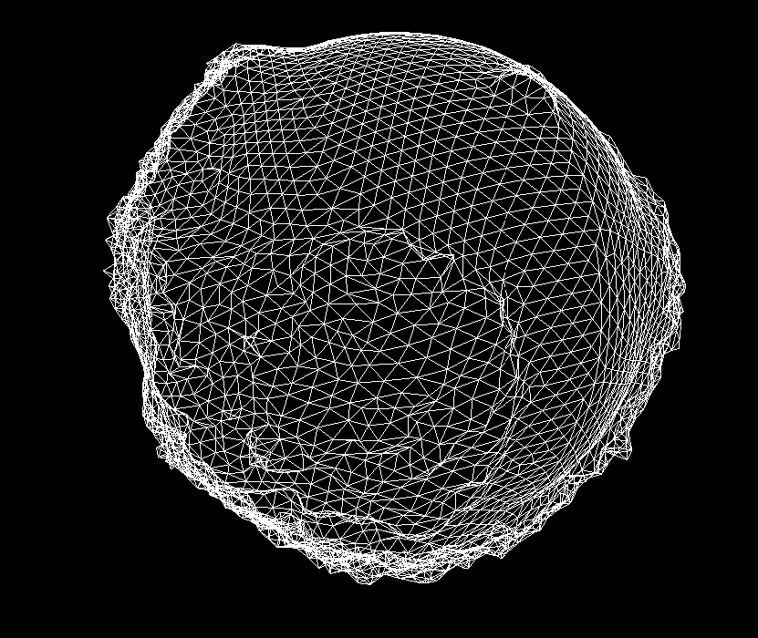
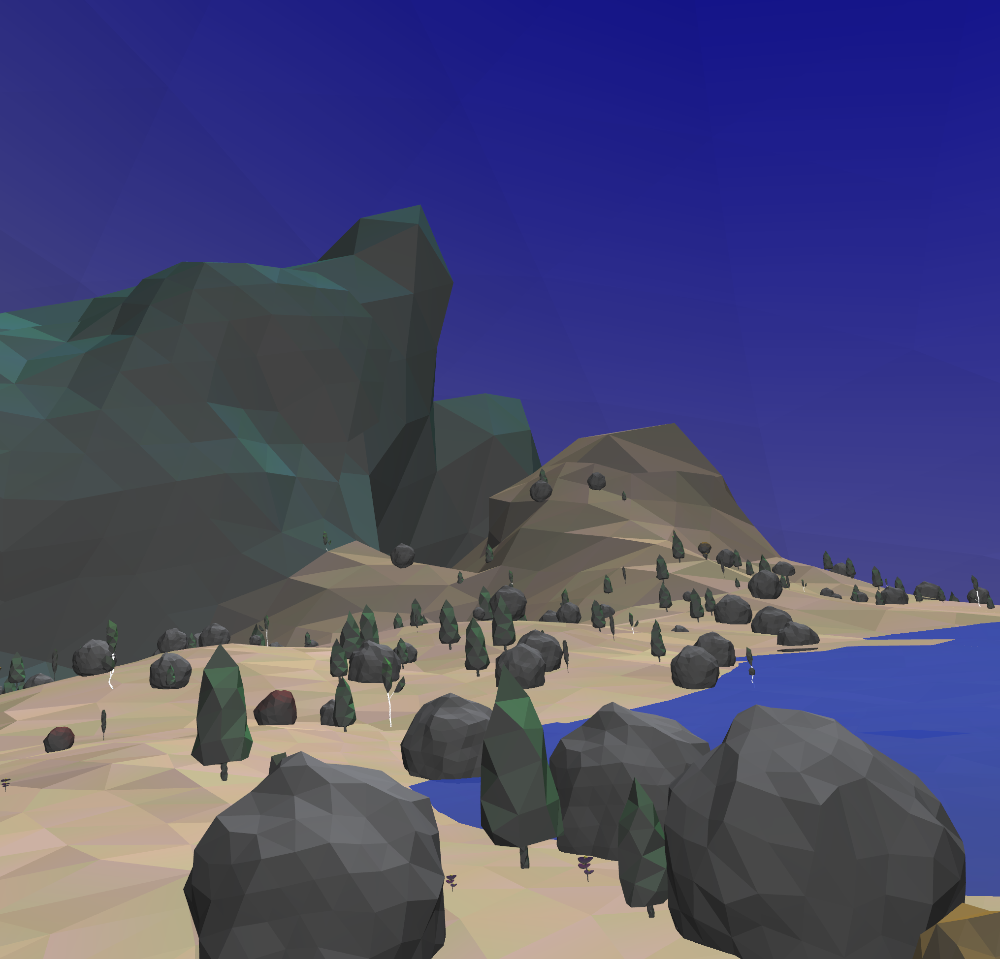
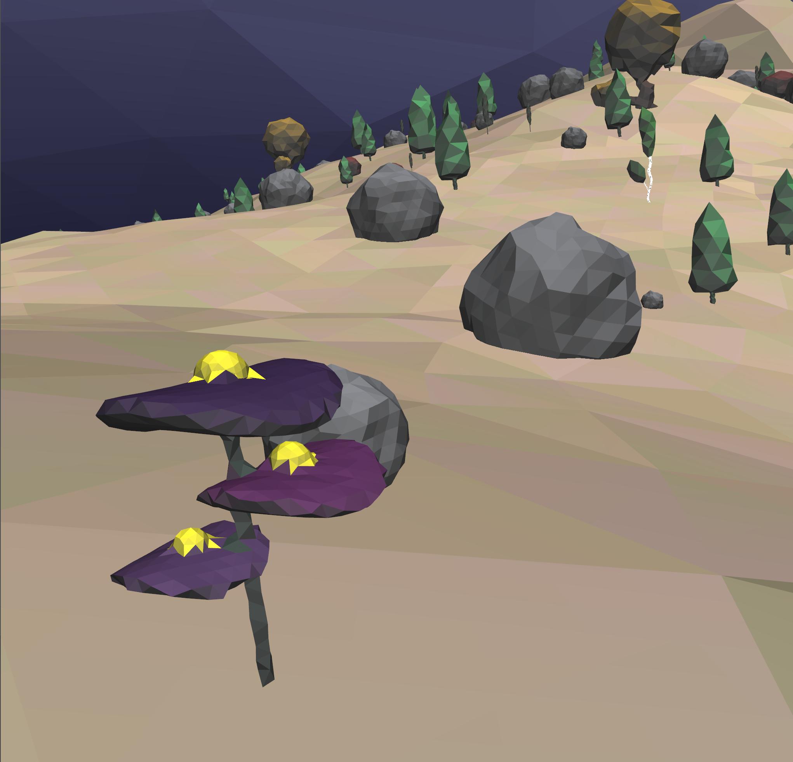

# Advancing Front Triangulation

This project implements advancing front triangulation, also known as marching triangles, over a signed distance field. The algorithm works by finding a surface and then placing triangles as the surface traversal progresses.

It can be used to triangulate large terrains around a camera/player as well as static objects. I originally wrote the code in Java around 2014 for a personal game that was never released.

Since there are not many available triangulation libraries, I took some time to port it to C++ and open-source it.

It uses GLAD and GLFW and has been tested on Windows, macOS, and Linux (Ubuntu).

## Installation

TODO

## Contributions

Feel free to contribute, I'm not sure how much time I have but please reach out to me with any questions.

## Examples

Running this project will triangulate a few example objects and a planet, as shown in the images below. You can move around using the keyboard (`WASD` + arrow keys).

### A sphere and cube

### A Sphere minus a cuboid

### The union of a sphere and cube

### A planet with mountains

## Images/Video from the old Java version

Uses the same algorithm but with more color and complex terrains and objects. Everything in the images is triangulated from SDFs (flowers, trees, terrain, skybox, etc.).

### Flower and objects

### Complex terrain

### Early video illustrating the marching triangles

