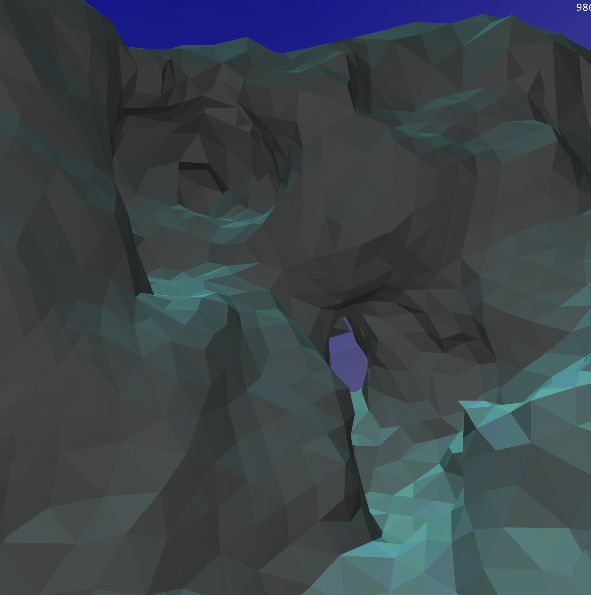

# Advancing Front Triangulation

Implements advancing front triangulation aka marching triangles over a signed distance field.

The algorithm works by finding a surface, and then placing triangles as the surface traversal progresses.

It can be used to triangulate large terrains around a camera/player as well as static objects.

The code was originally written in Java (~2014) intended for a game that I never saw the days light.

Since there are not many available triangulators I took some time and ported it to C++ to open source it.

It used GLAD+GLFW and has been tested on Windows, Mac and Linux (ubuntu).

## Examples

The projects includes a main function, running it will triangulate a few example objects and a planet.

You can move around with the keyboard (ASDW + arrows).

### A sphere and cube

### A Sphere minus a cuboid

### The union of a sphere and cube

### A planet with moutains

## Images/Video from the old Java version

Uses the same algorithm but with more color and complex terrains and objects. Everything on the images are triangulated from sdfs (flowers, trees, terrain, sky box etc.).

### Flower and objects

### Complex terrain

### Early video illustrating the marching triangles

## Installation

TODO

## Contributions

Feel free to contribute, I'm not sure how much time I've but please reach out to me with any questions.
